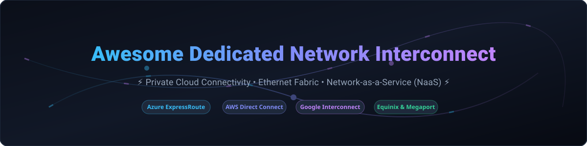

  

# 🌐 Awesome Dedicated Network Interconnect

  
  
  
  

---

## 🚀 Overview

**A curated, SEO-optimized list of top SaaS products, enterprise solutions, and open-source GitHub projects for Dedicated Network Interconnect, Private Cloud Connectivity, Ethernet Fabric, and Network-as-a-Service (NaaS).**

*Last updated: October 2026*

Dedicated Network Interconnect solutions establish private, high-bandwidth, low-latency connections between enterprise on-premises data centers, colocation facilities, and public cloud providers (AWS, Azure, Google Cloud, Oracle Cloud)—bypassing the public internet for enhanced security, SLA-backed reliability, and predictable performance.

---

## 📖 Table of Contents

- [☁️ SaaS & Commercial NaaS Platforms](#️-saas--commercial-naas-platforms)
- [🔓 Open-Source GitHub Projects](#-open-source-github-projects)
- [🤝 How to Contribute](#-how-to-contribute)
- [💖 Support & Sponsorship](#-support--sponsorship)
- [⭐ Star History](#-star-history)
- [⚠️ Disclaimer](#️-disclaimer)

---

## ☁️ SaaS & Commercial NaaS Platforms

> **📊 Sector & Market Analysis**: The global dedicated network interconnect market is estimated at **~$5.2 Billion in 2026** and projected to reach **~$12.5 Billion by 2032** (CAGR ~15.5%). The sector is **moderately concentrated**: cloud hyperscalers (Amazon, Microsoft, Alphabet) dominate native connectivity, while specialized Network-as-a-Service (NaaS) platforms like Equinix Fabric, Megaport, and Console Connect lead the carrier-neutral interconnect layer. Enterprise multi-cloud strategy prevents a single winner-take-all monopoly.

| Platform | Description | Pricing (Starting Tier) | Free Tier / Trial Limits | Company Size (Revenue / Valuation) |
| :--- | :--- | :--- | :--- | :--- |
| **[AWS Direct Connect](https://aws.amazon.com/directconnect/)** | Dedicated private network connection from on-prem to AWS infrastructure. | **€0.0296/hr (~€21.61/mo)** for Hosted 50 Mbps port; **€0.2961/hr (~€216/mo)** for 1 Gbps Dedicated port. Data transfer in is free. | **30-day Free Trial** via AWS Free Tier ($100–$200 new account credits); no perpetual free tier. | **~$638 Billion revenue** (Amazon FY2025) |
| **[Google Cloud Interconnect](https://cloud.google.com/network-connectivity/docs/interconnect)** | High-speed dedicated or partner connection to Google Cloud Platform. | **$0.05/hr (~$36.50/mo)** per 50 Mbps VLAN attachment (Partner) or **$1.70/hr (~$1,241/mo)** for 10 Gbps Dedicated port. | **90-day Free Trial** ($300 GCP trial credits applied to interconnect charges); no perpetual free tier. | **~$350 Billion revenue** (Alphabet FY2025) |
| **[Azure ExpressRoute](https://azure.microsoft.com/en-us/services/expressroute/)** | Private direct connection to Microsoft Azure and Office 365 cloud services. | **$55/month** for 50 Mbps Metered Port + $0.025/GB outbound data transfer. | **30-day Free Trial** ($200 Azure credit); no perpetual free tier, billing starts upon circuit creation. | **~$281 Billion revenue** (Microsoft FY2025) |
| **[Telstra Cloud Sight](https://www.telstra.com.au/)** | Enterprise cloud connectivity from Telstra Next IP network to multi-cloud environments. | **$180/month** base port allocation charge; no setup or MAC fees. | **30-day Enterprise Trial** with complimentary proof-of-concept testing; no perpetual free tier. | **~$20 Billion revenue** (Telstra FY2025) |
| **[Lumen Cloud Connect](https://www.lumen.com/)** | Layer-2 & Layer-3 private connectivity linking enterprise sites to clouds via eLynk. | **$450/month** for 100 Mbps dedicated circuit port connection. | **30-day Demo / POC** available for qualified enterprise accounts; no perpetual free tier. | **~$10 Billion revenue** (Lumen FY2025) |
| **[Equinix Fabric](https://www.equinix.com/)** | Global software-defined interconnection platform connecting data centers and clouds. | **$225/month** for 1 Gbps standard virtual connection port + VC usage fees. | **30-day Trial Access** for existing Equinix Portal customers; local connections on-demand. | **~$8 Billion revenue** (Equinix FY2025) |
| **[Console Connect](https://www.consoleconnect.com/)** | Tier-1 private global IP network NaaS platform with automated provisioning. | **$120/month** for 1 Gbps Metro Virtual Circuit (Pay-As-You-Go). | **7-day Free Trial** with $100 test credit upon business verification; no long-term contracts. | **~$4.5 Billion revenue** (PCCW Global parent) |
| **[Colt Dedicated Cloud Access](https://www.colt.net/)** | European & Asian enterprise dedicated cloud access with flexible On-Demand NaaS. | **€190/month** for 100 Mbps DCA flexible access port (no cloud port fees). | **30-day POC Trial** for enterprise buyers; free virtual cloud ports for AWS/Azure/GCP. | **~$1.8 Billion revenue** (Colt Telecom / Fidelity) |
| **[PacketFabric](https://www.packetfabric.com/)** | On-demand NaaS platform offering private multi-cloud and internet exchange routing. | **$0/month** for Metro Virtual Circuits; Longhaul metered starting at **$0.02/GB**. | **Perpetual Free Tier** for all Metro Virtual Circuits regardless of capacity. | **~$100 Million+ valuation** (Private / Raised $100M+) |
| **[Megaport](https://www.megaport.com/)** | Neutral software-defined network (SDN) platform across 850+ enabled locations. | **$100/month** for 1 Gbps Metro Virtual Cross Connect (VXC). | **14-day Free Test Drive** credit for new platform registrations; no long-term commitment. | **~$85 Million revenue** (Megaport Limited FY2025) |

---

## 🔓 Open-Source GitHub Projects

*Sorted by GitHub Stars_Count (Descending). Stars_Badges link directly to each repository's stargazers page.*

| Project | Description | GitHub_Stars |
| :--- | :--- | :---: |
| **[FRRouting (FRR)](https://github.com/FRRouting/frr)** | IP routing protocol suite for Linux and Unix platforms implementing BGP, OSPF, RIP, IS-IS, and PBR for cloud interconnect peering. |  |
| **[WireGuard](https://github.com/WireGuard/wireguard-linux)** | Extremely simple yet fast and modern VPN that utilizes state-of-the-art cryptography for lightweight site-to-site cloud interconnects. |  |
| **[strongSwan](https://github.com/strongswan/strongswan)** | Complete IPsec implementation providing encrypted multi-cloud site-to-site VPN tunnels for AWS, Azure, and Google Cloud. |  |
| **[OpenDaylight](https://github.com/opendaylight/mdsal)** | Open-source modular SDN controller platform for network programmability, automation, and BGP/NETCONF management. |  |
| **[TeraFlowSDN](https://github.com/etsi-tfs/controller)** | ETSI cloud-native SDN controller for multi-vendor, multi-layer transport networks supporting L2/L3 VPN service delivery (RFC 8466). |  |
| **[ONAP](https://github.com/onap/parent)** | Open Network Automation Platform providing real-time, policy-driven orchestration and automation of physical/virtual network functions. |  |
| **[ETSI OSM](https://github.com/opensourceMANO/OSM)** | Open Source MANO NFV management and orchestration software stack aligned with ETSI NFV for end-to-end cloud interconnect service delivery. |  |

---

## 🤝 How to Contribute

Contributions are welcome! Please follow these simple guidelines:

1. Fork this repository.
2. Add your product or open-source tool to `README.md` following the exact table structure.
3. Ensure pricing and free tier/trial details are verified against official documentation.
4. Submit a Pull Request with a clear description of your additions.

Please review the curated collection at [Awesome-Awesome-Awesome](https://github.com/ishandutta2007/Awesome-Awesome-Awesome) for complementary lists!

---

## 💖 Support & Sponsorship

If you find this repository helpful for your network architecture and cloud connectivity research, please consider supporting the project:

- 🌟 **Star the repository** to help others discover it.
- 🔀 **Fork and share** with your network engineering team.
- ☕ **Buy me a coffee** on GitHub Sponsors:

Thank you for supporting open-source cloud networking resource curation!

---

## ⭐ Star History

---

## ⚠️ Disclaimer

- This repository is a community-curated collection intended for educational and research purposes.
- All pricing and company size metrics are derived from public disclosures and verified search data, subject to change without notice.
- Open-source SDN controllers and VPN software manage control planes and encrypted overlays; physical dark fiber and cross-connect fabric require commercial NaaS or carrier providers.
